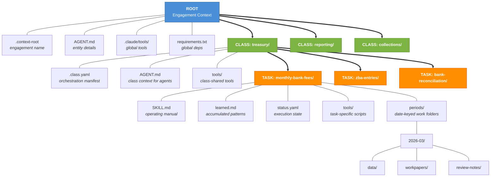
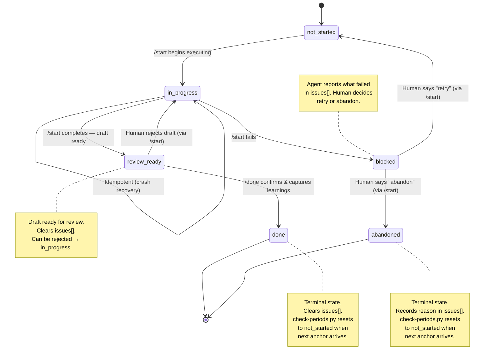
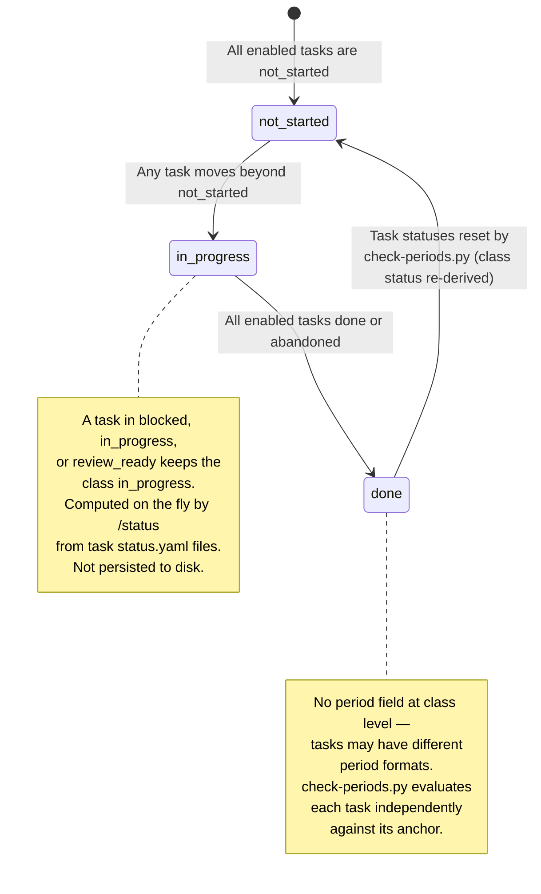
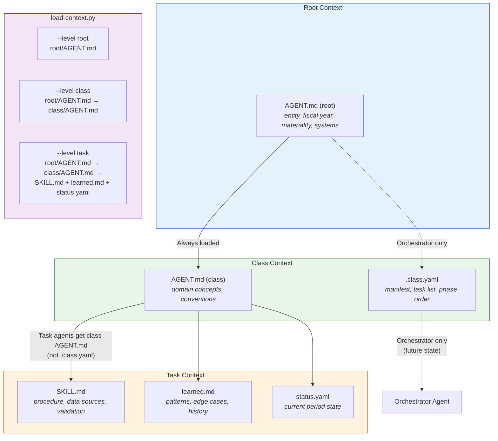
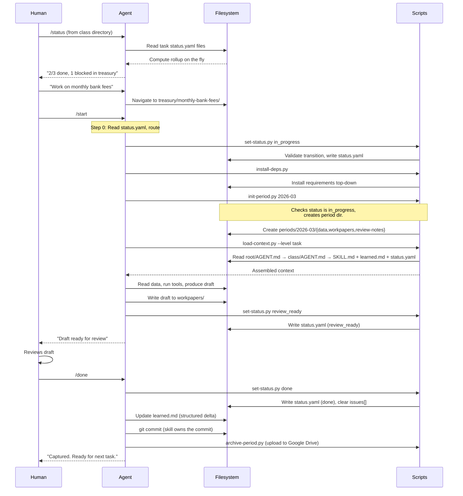
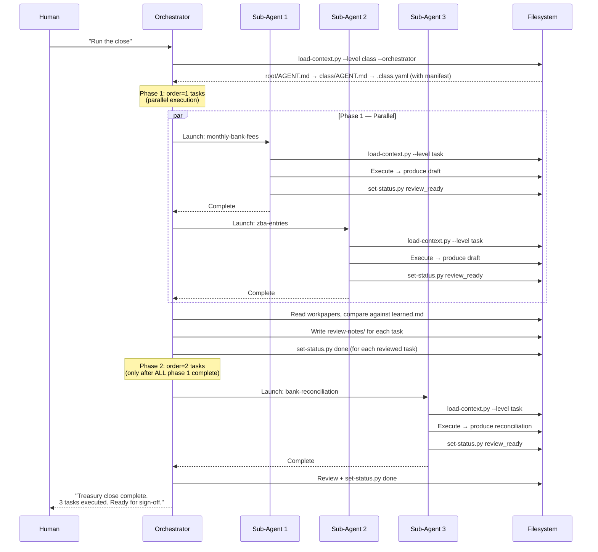
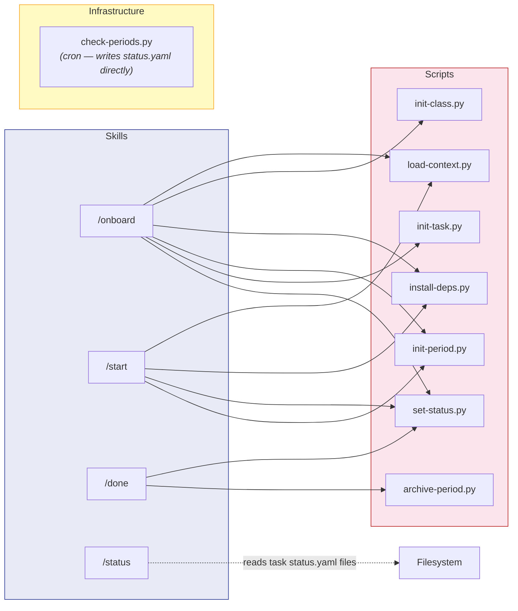
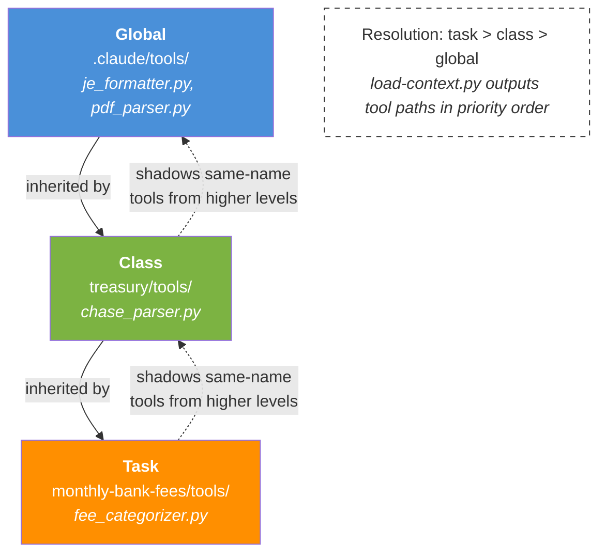
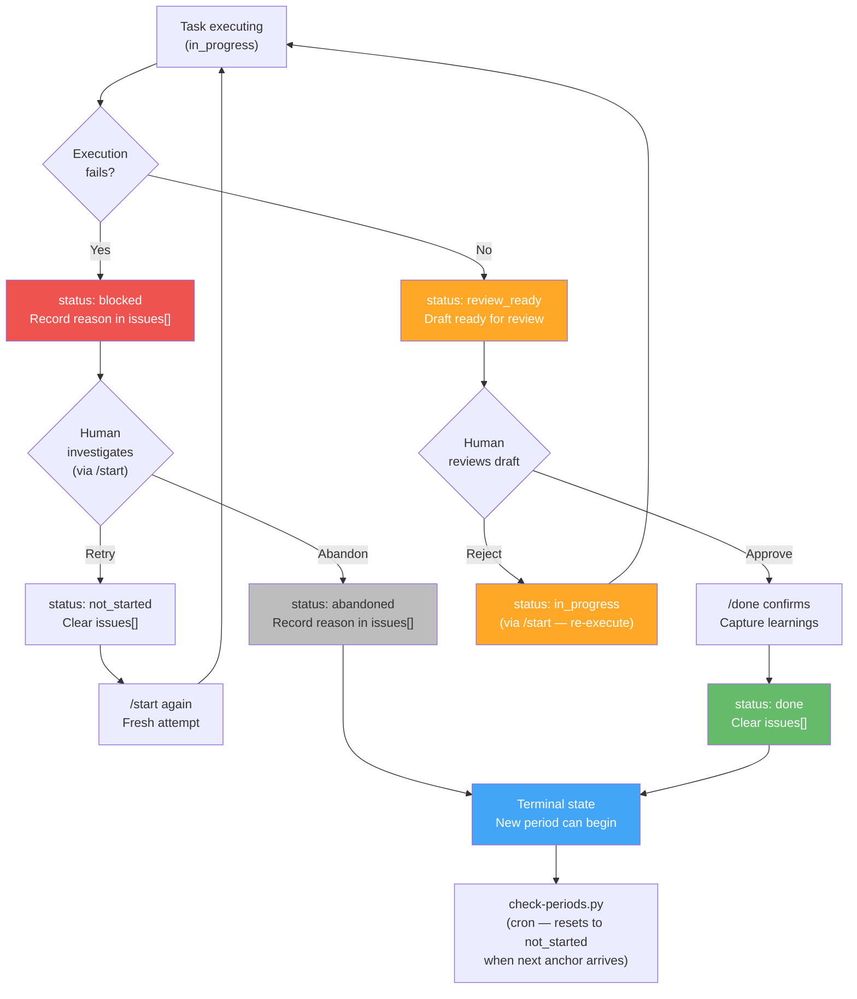

# Context Engineer — Mermaid Diagrams

## 1. Three-Level Hierarchy (System Architecture)

---

## 2. Task Status State Machine

---

## 3. Class Status Computation

---

## 4. Context Inheritance (Data Flow Down)

---

## 5. MVP Workflow (Human as Orchestrator)

---

## 6. Future State: Orchestrator Workflow

---

## 7. Script Composition (Skills → Scripts)

---

## 8. Tool Inheritance (Resolution Order)

---

## 9. Blocked Recovery Flow

